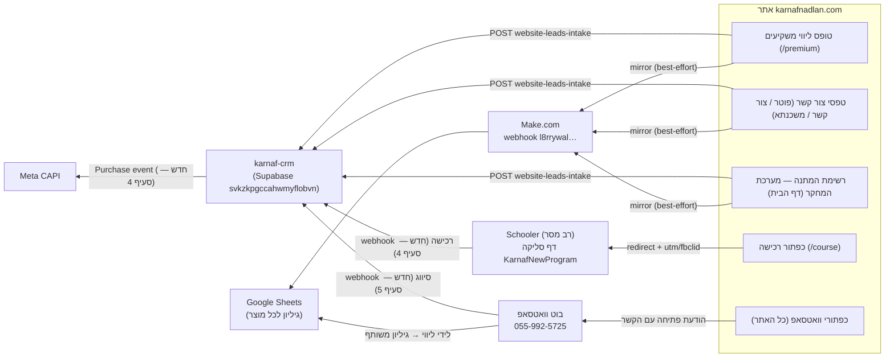

# ארכיטקטורת אינטגרציות — אתר קרנף נדל"ן ↔ karnaf-crm

**מסמך עבודה לצוות הפיתוח של karnaf-crm.** עודכן: יולי 2026.
מגדיר את כל החוזים (contracts) בין האתר, דף הסליקה (Schooler), בוט הוואטסאפ,
Make.com, Google Sheets ומערכת karnaf-crm — כולל מה קיים ומה נדרש לפתח.

---

## 1. תמונה כוללת



**עקרון מנחה:** האתר הוא צד שולח בלבד (סטטי, בלי backend). כל לוגיקת הסיווג,
הטיקטים וההתראות ממומשת ב-karnaf-crm, בבוט וב-Make.

---

## 2. חוזה `website-leads-intake` (קיים — נדרשות הרחבות)

Endpoint (קיים): `https://svkzkpgccahwmyflobvn.functions.supabase.co/website-leads-intake`

### 2.1 Payload מהאתר (JSON, POST)

| שדה | סוג | חובה | הערות |
|---|---|---|---|
| `name` | string | ✔ | שם מלא |
| `phone` | string | ✔ | ולידציית פורמט ישראלי בצד לקוח |
| `email` | string | — | **חדש בפועל**: חובה בטופס ליווי משקיעים |
| `service` | string | — | `premium` / `mortgage` / `derech` / `webinar` / `waitlist` |
| `source` | string | ✔ | מזהה הטופס — ראו טבלת מיפוי 2.2 |
| `equity` | string | — | הון עצמי במדרגות ₪250K (טופס ליווי בלבד) |
| `message` | string | — | מהות הפנייה — להציג בטיקט |
| `product` | string | ✔ | `course` / `premium` / `mortgage` / `research` |
| `product_label` | string | ✔ | תווית עברית של המוצר |
| `page_path`, `page_url` | string | ✔ | מאיפה נשלח הטופס |
| `landing_page`, `referrer` | string | ✔ | first-touch פר-סשן |
| `utm_source/medium/campaign/content/term` | string | ✔ (יכול להיות ריק) | first-touch פר-סשן |

### 2.2 מיפוי סיווג + טיקט נדרש ב-CRM (לפי `source`)

| `source` | סיווג לקוח ב-CRM | טיקט שנפתח | מקור פנייה | מהות פנייה |
|---|---|---|---|---|
| `premium-investors` | **ליווי משקיעים** | "תיאום פגישת היכרות" — משויך לתור המלווה | אתר — דף ליווי משקיעים | מתוך `message` + `equity` |
| `research-waitlist` | **רשימת המתנה — מערכת המחקר** | "עדכון בהשקה" (עדיפות נמוכה) | אתר — דף הבית | הרשמה לרשימת המתנה |
| `website` / `footer` | פנייה כללית | "מענה לפנייה" | אתר — טופס יצירת קשר | `service` אם נבחר |
| `mortgage` | משכנתא | "מענה לפניית משכנתא" | אתר — דף משכנתא | ייעוץ משכנתא |

> ⚠️ **פעולה נדרשת:** לוודא שה-intake מקבל את הערכים החדשים
> `source=research-waitlist`, `product=research` ו-`equity` במדרגות החדשות
> (עד 250 / 250–500 / 500–750 / 750–1,000 / מעל מיליון) בלי לדחות את הבקשה.
> כל שדה לא מוכר — להתעלם, לא להחזיר שגיאה (400 מפיל את חוויית הטופס).

### 2.3 דרישות אמינות

- **Idempotency**: מפתח מומלץ `hash(phone + source + יום)` למניעת כפילויות
  בלחיצה כפולה.
- **תשובות**: `2xx` בלבד בהצלחה. גוף שגיאה `{ "error": "הודעה בעברית" }` —
  מוצג למשתמש בטוסט.
- **Rate limiting**: מומלץ 5 בקשות/שעה/IP (קיים דפוס בפונקציית submit-lead
  הישנה — כולל HMAC, ראו סעיף 7).

---

## 3. לידי ליווי משקיעים → גיליון משותף עם המלווה (עדכון קיים)

הזרימה הקיימת: הטופס שולח mirror ל-Make (webhook `l8rrywal…`) והראוטר מפנה
לפי `product` לגיליון של כל מוצר (ראו docs/LEADS.md).

**פעולה נדרשת (Make, לא קוד):** להפנות את מסלול `product=premium` לגיליון
המשותף החדש עם מלווה המשקיעים:

- Spreadsheet ID: **`1KG3tw90wz0CmnhVI2qaLl7762IIKL7W5-6O0grn8pcg`**
- עמודות (A–Q, כמו כל הגיליונות): timestamp (Asia/Jerusalem), שם, טלפון,
  מייל, מוצר, טופס, עמוד, URL מלא, referrer, utm_source, utm_medium,
  utm_campaign, utm_content, utm_term, הודעה, שלב, **הון עצמי**.
- לוודא `valueInputOption: RAW` (שימור אפס מוביל בטלפון).
- להוסיף מסלול ל-`product=research` (גיליון חדש או צירוף לגיליון הקורס —
  החלטת בעלים).

---

## 4. רכישות מ-Schooler → CRM + Meta CAPI (חדש — לפיתוח)

הקורס הדיגיטלי נמכר ישירות בדף הסליקה:
`https://my.schooler.biz/s/117502/KarnafNewProgram?tid=30291&utm_source=קרנף26`
(מחיר: ₪980). האתר מעביר לכתובת זו גם `utm_*` (first-touch) ו-click IDs
(`fbclid`/`gclid`/`ttclid`) — בלי לדרוס את הפרמטרים הקיימים.

### 4.1 Webhook רכישה (Schooler → CRM)

להגדיר ברב מסר/Schooler webhook על השלמת תשלום, אל endpoint חדש ב-CRM
(מוצע: `schooler-purchase-intake`). על כל רכישה:

1. **יצירת/עדכון לקוח** בסיווג **"רוכש תוכנית דיגיטלית"**.
2. **פתיחת טיקט onboarding**: "וידוא גישה לתוכנית" (סגירה אוטומטית אם יש
   אינדיקציית גישה).
3. **דה-דופ** לפי מזהה עסקה של Schooler (`event_id`).

### 4.2 Meta Conversions API (CRM → Meta)

מטרה: לסגור את לולאת "נוטשי הסליקה". האתר יורה `InitiateCheckout`
(פיקסל 1659334891302781) בלחיצה על כפתור הרכישה; אירוע ה-`Purchase` חייב
להגיע צד-שרת כי התשלום קורה בדומיין של Schooler:

- על כל webhook רכישה — לשלוח `Purchase` ל-CAPI עם: `value: 980`,
  `currency: ILS`, `event_id` (מזהה העסקה — דה-דופ מול הפיקסל),
  ו-user_data מגובב (email/phone) + `fbclid` אם הגיע בפרמטרים של הסליקה.
- **קהל רימרקטינג** (הגדרה ב-Ads Manager, לא בקוד): Custom Audience =
  `InitiateCheckout` ב-30 הימים האחרונים **פחות** `Purchase` ב-30 הימים
  האחרונים. זה קהל "לחצו ולא סלקו" לטירגוט המשך.

> הערה: מבקר אנונימי שלחץ ולא שילם ניתן לזיהוי רק ברמת פיקסל/קוקי — אין
> לאתר טלפון/מייל שלו. לכן ההחרגה חיה כולה בצד Meta (פיקסל + CAPI).

---

## 5. בוט הוואטסאפ (055-992-5725) — זרימה וחוזה (חדש — לפיתוח בפלטפורמת הבוט)

כל כפתורי הוואטסאפ באתר פותחים שיחה עם הבוט, עם הודעת פתיחה מוכנה:

```
היי קרנף! אשמח לפרטים (הגעתי מהאתר — <הקשר>)
```

ערכי `<הקשר>` שהאתר שולח: `התוכנית הדיגיטלית` · `התוכנית הדיגיטלית — שאלה
לפני רכישה` · `התוכנית הדיגיטלית — בדיקת התאמה` · `ליווי משקיעים פרימיום` ·
`קרנף משכנתא` · `יצירת קשר` · `שאלה כללית`. אפשר להשתמש בהקשר לדילוג על
שאלת הסיווג או לתיוג מקדים ב-CRM.

### 5.1 זרימת שיחה

1. **פתיחה (כל הודעה ראשונה):**
   "היי, כאן קרנף נדל״ן 🦏 כדי שנוכל לעזור בצורה מדויקת — איזה שירות מעניין אתכם?"
   שלושה כפתורים:
   - 🎓 **התוכנית הדיגיטלית**
   - 🤝 **ליווי משקיעים פרימיום**
   - 💬 **נושא אחר**
2. **כפתור 1 — תוכנית דיגיטלית:**
   - תשובה: טקסט קצר + קישור לדף הסליקה (סעיף 4) —
     "מעולה! התוכנית הדיגיטלית המקיפה בישראל — ₪980, גישה מיידית: <קישור>"
   - סיומת קבועה: "אם לא קיבלת מענה לפנייתך — כתבו את המילה **נציג**."
   - Webhook ל-CRM: סיווג **"מתעניין תוכנית דיגיטלית"** + טיקט מעקב.
3. **כפתור 2 — ליווי משקיעים:**
   - תשובה: "קיבלנו! נציג מהצוות יחזור אליכם לתיאום שיחת היכרות — חינם וללא התחייבות."
   - סיומת "נציג" כנ"ל.
   - Webhook ל-CRM: סיווג **"ליווי משקיעים"** + טיקט "תיאום פגישה".
   - שורה בגיליון המשותף (סעיף 3) עם שם + טלפון + מקור "בוט וואטסאפ".
   - הודעת התראה פנימית למספר העסקי 055-996-6175 עם פרטי המתעניין.
4. **כפתור 3 — נושא אחר:**
   - תשובה: "קיבלנו את פנייתך ונענה בהקדם 🙏"
   - Webhook ל-CRM: סיווג פנייה כללית + **דגל אדום / עדיפות גבוהה** —
     נדרש מענה אנושי מהיר.
5. **מילת "נציג" (בכל שלב, וגם וריאציות: "נציג בבקשה", "אפשר נציג"):**
   - Webhook ל-CRM: **אסקלציה — ממתין לנציג/ה** בסטטוס בולט לתור של נציגת
     שירות הלקוחות, כולל תמלול קצר של השיחה עד כה.

### 5.2 חוזה webhook בוט → CRM (מוצע)

```json
{
  "channel": "whatsapp-bot",
  "phone": "9725XXXXXXXX",
  "name": "<שם הפרופיל בוואטסאפ>",
  "classification": "digital-course | premium-investors | other | agent-escalation",
  "site_context": "<ההקשר מהודעת הפתיחה, אם היה>",
  "flag": "none | red | escalation",
  "transcript_summary": "<3-5 הודעות אחרונות>",
  "event_id": "<מזהה שיחה+שלב לדה-דופ>",
  "timestamp": "ISO-8601"
}
```

דרישות: idempotency לפי `event_id`; ליד קיים (אותו טלפון) — לעדכן סיווג,
לא ליצור כפול.

---

## 6. מפת מקורות ליד מלאה (לתצוגת "מקור פנייה" ב-CRM)

| ערוץ | מזהה | הערות |
|---|---|---|
| טופס ליווי משקיעים | `premium-investors` | כולל email + equity |
| טופס צור קשר / פוטר | `website` / `footer` | |
| טופס משכנתא | `mortgage` | |
| רשימת המתנה מחקר | `research-waitlist` | חדש |
| בוט וואטסאפ | `whatsapp-bot` + classification | חדש |
| רכישת Schooler | `schooler-purchase` | חדש |
| רב מסר (משכנתא) / FB Lead Ads | דרך `make-intake` | קיים |

---

## 7. אבטחה

- **חתימת HMAC**: בפונקציית submit-lead הישנה (הוסרה מהריפו, זמינה
  בהיסטוריית git) קיים דפוס מוכן: `x-karnaf-signature: HMAC-SHA256(body,
  secret)` + `x-karnaf-idempotency`. מומלץ לאמץ אותו בכל ה-endpoints
  החדשים (Schooler webhook, bot webhook) עם secret ייעודי לכל מקור.
- **הרשאות Sheets**: שיתוף הגיליון בלבד למלווה — לא גישת CRM.
- **PII**: טלפונים/מיילים ל-Meta CAPI — מגובבים (SHA-256) בלבד.
- **Rate limiting** על כל endpoint ציבורי.

---

## 8. צ'קליסט לצוות karnaf-crm

**צד CRM (קוד):**
- [ ] `website-leads-intake`: קבלת `source=research-waitlist`, `product=research`, מדרגות equity חדשות; אי-דחיית שדות לא מוכרים.
- [ ] מיפוי סיווג/טיקט אוטומטי לפי טבלה 2.2.
- [ ] endpoint חדש `schooler-purchase-intake` (סעיף 4.1) + שליחת Purchase ל-Meta CAPI (סעיף 4.2).
- [ ] endpoint חדש לבוט (סעיף 5.2) כולל אסקלציית "נציג" לתור נציגת שירות.

**צד בוט (פלטפורמת הבוט):**
- [ ] תפריט 3 כפתורים + זיהוי מילת "נציג" (סעיף 5.1).
- [ ] שליחת קישור הסליקה בכפתור 1; התראה למספר העסקי בכפתור 2.

**צד Ops (בעלים / Make / Meta / Schooler):**
- [ ] Make: מסלול premium → גיליון `1KG3tw90wz0CmnhVI2qaLl7762IIKL7W5-6O0grn8pcg`; מסלול ל-`research`.
- [ ] Schooler: הגדרת webhook רכישה אל ה-endpoint החדש.
- [ ] Meta Ads: קהל InitiateCheckout-פחות-Purchase (סעיף 4.2).
- [ ] Vercel (אופציונלי): `VITE_WHATSAPP_BOT_NUMBER` כמתג חירום אם הבוט לא זמין — האתר כבר מוכן.

**סנכרון עם האתר:** כל שינוי בערכי `source`/`product` — לעדכן במקביל את
`src/lib/leadSubmission.ts` + `src/lib/pixel.ts` בריפו האתר (ראו docs/LEADS.md).
