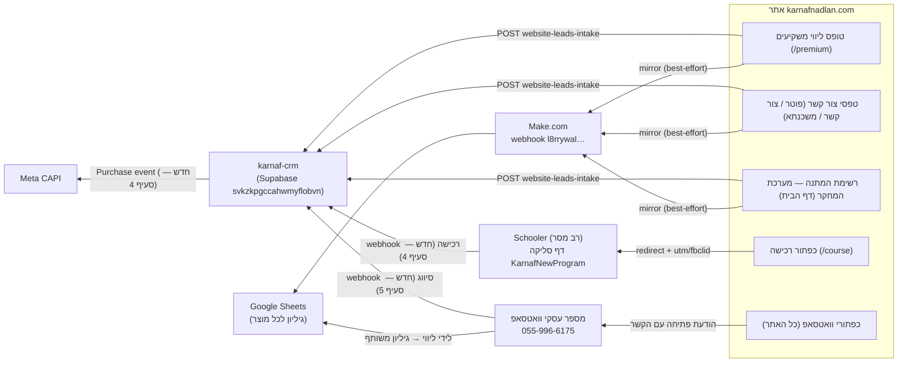

# ארכיטקטורת אינטגרציות — אתר קרנף נדל"ן ↔ karnaf-crm

**מסמך עבודה לצוות הפיתוח של karnaf-crm.** עודכן: יולי 2026.
מגדיר את כל החוזים (contracts) בין האתר, דף הסליקה (Schooler), בוט הוואטסאפ,
Make.com, Google Sheets ומערכת karnaf-crm — כולל מה קיים ומה נדרש לפתח.

---

## 1. תמונה כוללת


```mermaid
flowchart RL
  subgraph WEB["אתר karnafnadlan.com"]
    F1["טופס ליווי משקיעים (/premium)"]
    F2["טפסי צור קשר (פוטר / צור קשר / משכנתא)"]
    F3["רשימת המתנה — מערכת המחקר (דף הבית)"]
    B1["כפתור רכישה (/course)"]
    W1["כפתורי וואטסאפ (כל האתר)"]
  end

  SCHOOLER["Schooler (רב מסר)\nדף סליקה KarnafNewProgram"]
  BOT["מספר עסקי וואטסאפ\n055-996-6175"]
  MAKE["Make.com\nwebhook l8rrywal…"]
  SHEETS["Google Sheets\n(גיליון לכל מוצר)"]
  CRM["karnaf-crm\n(Supabase svkzkpgccahwmyflobvn)"]
  META["Meta CAPI"]

  F1 & F2 & F3 -->|"POST website-leads-intake"| CRM
  F1 & F2 & F3 -->|"mirror (best-effort)"| MAKE --> SHEETS
  B1 -->|"redirect + utm/fbclid"| SCHOOLER
  SCHOOLER -->|"webhook רכישה (חדש — סעיף 4)"| CRM
  CRM -->|"Purchase event (חדש — סעיף 4)"| META
  W1 -->|"הודעת פתיחה עם הקשר"| BOT
  BOT -->|"webhook סיווג (חדש — סעיף 5)"| CRM
  BOT -->|"לידי ליווי → גיליון משותף"| SHEETS
```

**עקרון מנחה:** האתר הוא צד שולח בלבד (סטטי, בלי backend). כל לוגיקת הסיווג,
הטיקטים וההתראות ממומשת ב-karnaf-crm, בבוט וב-Make.

---

## 2. חוזה `website-leads-intake` (קיים — נדרשות הרחבות)

Endpoint (קיים): `https://svkzkpgccahwmyflobvn.functions.supabase.co/website-leads-intake`

### 2.1 Payload מהאתר (JSON, POST)

| שדה | סוג | חובה | הערות |
|---|---|---|---|
| `name` | string | ✔ | שם מלא |
| `phone` | string | ✔ | ולידציית פורמט ישראלי בצד לקוח |
| `email` | string | — | **חדש בפועל**: חובה בטופס ליווי משקיעים |
| `service` | string | — | `premium` / `mortgage` / `derech` / `webinar` / `waitlist` |
| `source` | string | ✔ | מזהה הטופס — ראו טבלת מיפוי 2.2 |
| `equity` | string | — | הון עצמי במדרגות ₪250K (טופס ליווי בלבד) |
| `message` | string | — | מהות הפנייה — להציג בטיקט |
| `product` | string | ✔ | `course` / `premium` / `mortgage` / `research` |
| `product_label` | string | ✔ | תווית עברית של המוצר |
| `page_path`, `page_url` | string | ✔ | מאיפה נשלח הטופס |
| `landing_page`, `referrer` | string | ✔ | first-touch פר-סשן |
| `utm_source/medium/campaign/content/term` | string | ✔ (יכול להיות ריק) | first-touch פר-סשן |

### 2.2 מיפוי סיווג + טיקט נדרש ב-CRM (לפי `source`)

| `source` | סיווג לקוח ב-CRM | טיקט שנפתח | מקור פנייה | מהות פנייה |
|---|---|---|---|---|
| `premium-investors` | **ליווי משקיעים** | "תיאום פגישת היכרות" — משויך לתור המלווה | אתר — דף ליווי משקיעים | מתוך `message` + `equity` |
| `research-waitlist` | **רשימת המתנה — מערכת המחקר** | "עדכון בהשקה" (עדיפות נמוכה) | אתר — דף הבית | הרשמה לרשימת המתנה |
| `website` / `footer` | פנייה כללית | "מענה לפנייה" | אתר — טופס יצירת קשר | `service` אם נבחר |
| `mortgage` | משכנתא | "מענה לפניית משכנתא" | אתר — דף משכנתא | ייעוץ משכנתא |

> ⚠️ **פעולה נדרשת:** לוודא שה-intake מקבל את הערכים החדשים
> `source=research-waitlist`, `product=research` ו-`equity` במדרגות החדשות
> (עד 250 / 250–500 / 500–750 / 750–1,000 / מעל מיליון) בלי לדחות את הבקשה.
> כל שדה לא מוכר — להתעלם, לא להחזיר שגיאה (400 מפיל את חוויית הטופס).

### 2.3 דרישות אמינות

- **Idempotency**: מפתח מומלץ `hash(phone + source + יום)` למניעת כפילויות
  בלחיצה כפולה.
- **תשובות**: `2xx` בלבד בהצלחה. גוף שגיאה `{ "error": "הודעה בעברית" }` —
  מוצג למשתמש בטוסט.
- **Rate limiting**: מומלץ 5 בקשות/שעה/IP (קיים דפוס בפונקציית submit-lead
  הישנה — כולל HMAC, ראו סעיף 7).

---

## 3. לידי ליווי משקיעים → גיליון משותף עם המלווה ✅ מיושם (ספטמבר 2026)

הזרימה: הטופס שולח mirror ל-Make (webhook `l8rrywal…`) והראוטר מפנה לפי
`product` לגיליון של כל מוצר (ראו docs/LEADS.md).

מסלול `product=premium` בתרחיש **"קרנף — לידים מהאתר → גיליונות גיבוי"**
(scenario `9494567`) כותב עכשיו לשני יעדים, בזה אחר זה:

1. **גיליון הגיבוי** `1ZZfQApTdo-jiikknf60T_t19KItut7y6bzZCSR-jXzw` —
   פורמט A–Q המלא, כמו שאר המוצרים (ללא שינוי).
2. **הגיליון המשותף עם המלווה** — *"קובץ לידים ומעקב משותף קרנף שחר"*,
   `1KG3tw90wz0CmnhVI2qaLl7762IIKL7W5-6O0grn8pcg` (module `6`).

הגיליון המשותף הוא קובץ עבודה ידני עם מבנה עמודות משלו, ולכן המיפוי אליו
**שונה** משאר הגיליונות — הוא מותאם לעמודות הקיימות בקובץ:

| עמודה | מקור |
|---|---|
| A שם פרטי | המילה הראשונה ב-`name` |
| B שם משפחה | שאר המילים ב-`name` |
| C הון עצמי | `equity` |
| D איפה פנה | `אתר קרנף — {sourceLabel}` |
| E מתי פנה | תאריך הפנייה (DD/MM/YYYY, Asia/Jerusalem) |
| F מספר טלפון | `phone` |
| G פרטים נוספים | מייל · דף · utm_source · utm_campaign · `message` |
| H האם בוצעה שיחה | נשאר ריק (תיבת סימון ידנית) |
| I מטלות להמשך | נשאר ריק (ידני) |

- נבדק מקצה לקצה ב-9.9.2026: שורת בדיקה נכתבה, אומתה ונמחקה.
- **הערה על הטלפון:** למרות `valueInputOption: RAW`, Google Sheets מפרש
  `0501234567` כמספר ומוריד את האפס המוביל — בדיוק כמו בשורות שהוזנו ידנית
  בקובץ. אם רוצים לשמר את האפס, צריך לעצב את עמודה F כטקסט בגיליון עצמו.
- עדיין פתוח: מסלול ל-`product=research` (גיליון חדש או צירוף לגיליון
  הקורס — החלטת בעלים).

---

## 4. רכישות מ-Schooler → CRM + Meta CAPI (חדש — לפיתוח)

הקורס הדיגיטלי נמכר ישירות בדף הסליקה:
`https://my.schooler.biz/s/117502/KarnafNewProgram/t_JHrKI`
(מחיר: ₪950). האתר מעביר לכתובת זו גם `utm_*` (first-touch) ו-click IDs
(`fbclid`/`gclid`/`ttclid`) — כפרמטרי query בלבד, בלי לגעת בנתיב המעקב של
Schooler (`/t_JHrKI`) ובלי לדרוס פרמטרים קיימים.

### 4.1 Webhook רכישה (Schooler → CRM)

להגדיר ברב מסר/Schooler webhook על השלמת תשלום, אל endpoint חדש ב-CRM
(מוצע: `schooler-purchase-intake`). על כל רכישה:

1. **יצירת/עדכון לקוח** בסיווג **"רוכש תוכנית דיגיטלית"**.
2. **פתיחת טיקט onboarding**: "וידוא גישה לתוכנית" (סגירה אוטומטית אם יש
   אינדיקציית גישה).
3. **דה-דופ** לפי מזהה עסקה של Schooler (`event_id`).

### 4.1.1 פרמטרים שהאתר מצרף ל-URL הסליקה (חדש)

כפתורי הרכישה בונים את הכתובת דרך `buildCheckoutUrl()` ומצרפים, כשקיימים:

| פרמטר | מקור | למה זה חשוב ל-CRM |
|---|---|---|
| `utm_source/medium/campaign/content/term` | first-touch בסשן | שיוך קמפיין מלא לרכישה (utm_source נוסף אחרי המעבר לקישור מבוסס-נתיב) |
| `fbclid` / `gclid` / `ttclid` | ה-URL הנוכחי | שיוך קליק ממומן |
| `_fbp` / `_fbc` | קוקיז הפיקסל (‏_fbc מסונתז מ-fbclid בהיעדרו) | תפירת ה-Purchase בדף התודה לאותו גולש ולאותה מודעה |
| `karnaf_value` / `currency` | ‏constants (950 / ILS) | ערך ה-Purchase כשאין משתנה סכום מהפלטפורמה |
| `quiz_goal`, `quiz_concern`, `quiz_timeline` | שאלון ההתאמה בדף | סיווג הלקוח לפי הצורך שהצהיר עליו + חומר לאנשי המכירות |
| `ga_cid` | מזהה הלקוח של GA4 | **קריטי** — ראו 4.2.1 |

**בקשה מ-Schooler:** לשמר את הפרמטרים האלה על העסקה ולהחזיר אותם ב-webhook.

### 4.2 Meta Conversions API (CRM → Meta)

מטרה: לסגור את לולאת "נוטשי הסליקה". האתר יורה `InitiateCheckout`
(פיקסל 1659334891302781) בלחיצה על כפתור הרכישה; אירוע ה-`Purchase` חייב
להגיע צד-שרת כי התשלום קורה בדומיין של Schooler:

- על כל webhook רכישה — לשלוח `Purchase` ל-CAPI עם: `value: 950`,
  `currency: ILS`, `event_id` (מזהה העסקה — דה-דופ מול הפיקסל),
  ו-user_data מגובב (email/phone) + `fbclid` אם הגיע בפרמטרים של הסליקה.

> **מצב נוכחי (יולי 2026):** ה-`Purchase` נסגר כרגע ב**פיקסל בדף התודה** של
> Schooler/Grow (ראו `docs/PIXEL-CLOSED-LOOP.md`) — מהיר ובלי פיתוח שרת.
> ה-CAPI כאן הוא שדרוג עתידי; כשיתווסף, עליו להשתמש ב**אותו `event_id`**
> (מזהה ההזמנה) כמו הסניפט בדף התודה, כדי ש-Meta תבצע דה-דופ ולא תספור
> את הרכישה פעמיים.
- **קהל רימרקטינג** (הגדרה ב-Ads Manager, לא בקוד): Custom Audience =
  `InitiateCheckout` ב-30 הימים האחרונים **פחות** `Purchase` ב-30 הימים
  האחרונים. זה קהל "לחצו ולא סלקו" לטירגוט המשך.

> הערה: מבקר אנונימי שלחץ ולא שילם ניתן לזיהוי רק ברמת פיקסל/קוקי — אין
> לאתר טלפון/מייל שלו. לכן ההחרגה חיה כולה בצד Meta (פיקסל + CAPI).

### 4.2.1 דיווח רכישה ל-GA4 ‏(Measurement Protocol) — חדש, חשוב

הרכישה קורית בדומיין של Schooler, ולכן GA4 לא רואה אותה — כל האופטימיזציה
והניסויים באתר נשפטים היום על `begin_checkout` (קליק), לא על רכישה בפועל.

**הפתרון:** ה-webhook של Schooler ב-CRM ישלח אירוע `purchase` ל-GA4 Measurement
Protocol עם ה-`ga_cid` שהגיע בפרמטרים של העסקה:

```
POST https://www.google-analytics.com/mp/collect?measurement_id=<GA4_ID>&api_secret=<SECRET>
{
  "client_id": "<ga_cid מהעסקה>",
  "events": [{
    "name": "purchase",
    "params": {
      "transaction_id": "<מזהה עסקה מ-Schooler>",
      "value": 950, "currency": "ILS",
      "items": [{ "item_id": "derech-ladira", "item_name": "המדריך המעשי לרכישת דירה", "price": 950 }]
    }
  }]
}
```

אם `ga_cid` חסר (חוסם פרסומות / גולש ישיר) — לשלוח בלעדיו; האירוע פשוט לא
ישויך לסשן. **תוצאה:** משפך שלם בגוגל אנליטיקס ויכולת להכריע ניסויי A/B לפי
רכישות אמיתיות ולא לפי קליקים.

---

## 5. וואטסאפ — זרימה וחוזה

> **עדכון (ספטמבר 2026):** בוט האינטייק (055-992-5725) כבר **לא מקושר**
> מאף מקום באתר. כל כפתורי הוואטסאפ — בכל הדפים, כולל הניווט, הסרגל הדביק
> והכפתור הצף — פותחים את **המספר העסקי 055-996-6175** (`chatLink` /
> `businessLink` / `premiumLink` ב-`src/lib/whatsapp.ts`). התיאור של זרימת
> הבוט להלן נשמר כמפרט למי שיפעיל אותו שוב בעתיד; כרגע הוא לא בשימוש,
> וכל פנייה מגיעה כהודעה רגילה שמישהו צריך לענות עליה ולתייק ב-CRM ידנית.

כפתורי הוואטסאפ באתר פותחים שיחה עם הודעת פתיחה מוכנה, בניסוח טבעי (בלי
תגית עמוד בסוגריים). כל עמוד שולח משפט אחר, כך שמי שעונה יודע מאיפה הגיעה
הפנייה (`ChatIntent` ב-`src/lib/whatsapp.ts`):

| מאיפה | הודעת הפתיחה |
|---|---|
| ניווט, כפתור צף, דף הבית, סיפורי הצלחה | היי קרנף, הגעתי אליכם מהאתר ויש לי שאלה |
| הסרגל הדביק (הקורס) | היי קרנף, ראיתי באתר את הקורס הדיגיטלי ויש לי כמה שאלות עליו |
| כרטיס המחיר / בלוק הביטחון בדף הקורס | היי קרנף, אני לפני רכישת הקורס הדיגיטלי ויש לי שאלה |
| שאלון ההתאמה | היי קרנף, מילאתי באתר את שאלון ההתאמה ואשמח להתייעץ אם הקורס מתאים לי |
| פוטר, צור קשר | היי קרנף, הגעתי אליכם מהאתר ואשמח לדבר |
| עמוד המשכנתא | היי קרנף, קראתי באתר על ליווי המשכנתא ואשמח לשמוע איך זה עובד |
| דף התודה (וובינר / משכנתא / צור קשר) | היי קרנף, נרשמתי לוובינר ויש לי שאלה · …השארתי באתר פרטים לגבי משכנתא… · …השארתי באתר פרטים… |

> ### דף ליווי המשקיעים (`/premium`) — הודעת פתיחה ייעודית
>
> כל האתר פותח את אותו מספר עסקי; מה שמייחד את `/premium` הוא **נוסח**
> הודעת הפתיחה — כולל הניווט ("בואו נדבר"), הסרגל הדביק והכפתור הצף:
>
> ```
> היי קרנף, הגעתי מהאתר ואשמח לשמוע על ליווי המשקיעים האישי 1:1
> ```
>
> **מה זה אומר תפעולית:** פניות ליווי משקיעים שמגיעות מהדף **לא** יגיעו
> יותר כטיקטים מסווגים מהבוט (סעיף 5.2), אלא כהודעות רגילות במספר העסקי.
> מי שעונה שם צריך לפתוח את הליד ב-CRM ידנית עם `lead_source` =
> `premium-investors`. 
>
> הרציונל: ליד ליווי 1:1 שווה עשרות אלפי שקלים ומגיע בכוונה גבוהה —
> תפריט אוטומטי עולה יותר ממה ששווה הסיווג. מומש ב-`premiumLink()`
> (‏`src/lib/whatsapp.ts`) ובהוק `useWhatsAppLink` (‏`src/hooks/`).
>
> **הטופס בדף `/premium` לא הושפע** — הוא ממשיך לזרום ל-karnaf-crm
> ולגיליון המשותף בדיוק כמו קודם (סעיפים 2-3).

### 5.1 זרימת שיחה

1. **פתיחה (כל הודעה ראשונה):**
   "היי, כאן קרנף נדל״ן 🦏 כדי שנוכל לעזור בצורה מדויקת — איזה שירות מעניין אתכם?"
   שלושה כפתורים:
   - 🎓 **התוכנית הדיגיטלית**
   - 🤝 **ליווי משקיעים פרימיום**
   - 💬 **נושא אחר**
2. **כפתור 1 — תוכנית דיגיטלית:**
   - תשובה: טקסט קצר + קישור לדף הסליקה (סעיף 4) —
     "מעולה! התוכנית הדיגיטלית המקיפה בישראל — ₪950, גישה מיידית: <קישור>"
   - סיומת קבועה: "אם לא קיבלת מענה לפנייתך — כתבו את המילה **נציג**."
   - Webhook ל-CRM: סיווג **"מתעניין תוכנית דיגיטלית"** + טיקט מעקב.
3. **כפתור 2 — ליווי משקיעים:** (עדיין רלוונטי למי שמגיע לבוט מדפים אחרים —
   דף `/premium` עצמו פונה ישירות למספר העסקי, ראו יוצא הדופן בסעיף 5)
   - תשובה: "קיבלנו! נציג מהצוות יחזור אליכם לתיאום שיחת היכרות — חינם וללא התחייבות."
   - סיומת "נציג" כנ"ל.
   - Webhook ל-CRM: סיווג **"ליווי משקיעים"** + טיקט "תיאום פגישה".
   - שורה בגיליון המשותף (סעיף 3) עם שם + טלפון + מקור "בוט וואטסאפ".
   - הודעת התראה פנימית למספר העסקי 055-996-6175 עם פרטי המתעניין.
4. **כפתור 3 — נושא אחר:**
   - תשובה: "קיבלנו את פנייתך ונענה בהקדם 🙏"
   - Webhook ל-CRM: סיווג פנייה כללית + **דגל אדום / עדיפות גבוהה** —
     נדרש מענה אנושי מהיר.
5. **מילת "נציג" (בכל שלב, וגם וריאציות: "נציג בבקשה", "אפשר נציג"):**
   - Webhook ל-CRM: **אסקלציה — ממתין לנציג/ה** בסטטוס בולט לתור של נציגת
     שירות הלקוחות, כולל תמלול קצר של השיחה עד כה.

### 5.2 חוזה webhook בוט → CRM (מוצע)

```json
{
  "channel": "whatsapp-bot",
  "phone": "9725XXXXXXXX",
  "name": "<שם הפרופיל בוואטסאפ>",
  "classification": "digital-course | premium-investors | other | agent-escalation",
  "site_context": "<ההקשר מהודעת הפתיחה, אם היה>",
  "flag": "none | red | escalation",
  "transcript_summary": "<3-5 הודעות אחרונות>",
  "event_id": "<מזהה שיחה+שלב לדה-דופ>",
  "timestamp": "ISO-8601"
}
```

דרישות: idempotency לפי `event_id`; ליד קיים (אותו טלפון) — לעדכן סיווג,
לא ליצור כפול.

---

## 6. מפת מקורות ליד מלאה (לתצוגת "מקור פנייה" ב-CRM)

| ערוץ | מזהה | הערות |
|---|---|---|
| טופס ליווי משקיעים | `premium-investors` | כולל email + equity |
| טופס צור קשר / פוטר | `website` / `footer` | |
| טופס משכנתא | `mortgage` | |
| רשימת המתנה מחקר | `research-waitlist` | חדש |
| בוט וואטסאפ | `whatsapp-bot` + classification | חדש |
| רכישת Schooler | `schooler-purchase` | חדש |
| רב מסר (משכנתא) / FB Lead Ads | דרך `make-intake` | קיים |

---

## 7. אבטחה

- **חתימת HMAC**: בפונקציית submit-lead הישנה (הוסרה מהריפו, זמינה
  בהיסטוריית git) קיים דפוס מוכן: `x-karnaf-signature: HMAC-SHA256(body,
  secret)` + `x-karnaf-idempotency`. מומלץ לאמץ אותו בכל ה-endpoints
  החדשים (Schooler webhook, bot webhook) עם secret ייעודי לכל מקור.
- **הרשאות Sheets**: שיתוף הגיליון בלבד למלווה — לא גישת CRM.
- **PII**: טלפונים/מיילים ל-Meta CAPI — מגובבים (SHA-256) בלבד.
- **Rate limiting** על כל endpoint ציבורי.

---

### 5.3 הקשרים נוספים שהאתר שולח לבוט (חדש)

הודעת הפתיחה מהאתר נושאת את ההקשר בסוגריים. שני הקשרים חדשים דורשים טיפול:

| הקשר בהודעה | מקור בדף | מה הבוט צריך לעשות |
|---|---|---|
| `צ׳קליסט ביקור בנכס — בקשה מהאתר` | **הוסר מהאתר (יולי 2026)** — היה חלון היציאה בדף הקורס | הכוונה נשמרת ב-CRM לטיפול בפניות היסטוריות: לשלוח את קובץ הצ׳קליסט (PDF), לסווג כ**ליד מגנט — צ׳קליסט**, ולתייג לנרטור המשך. האתר לא מייצר את ההודעה הזו יותר |
| `התוכנית הדיגיטלית — שאלה לפני רכישה` | כרטיס המחיר ופס הביטחון | עדיפות גבוהה: זהו מתעניין ברמת כוונה מקסימלית שנעצר בגלל שאלה אחת |

> **אין שיעור פתוח לצפייה.** מה שפתוח הוא הסילבוס המלא וסרטון ההסבר בדף
> `/course`; פופ-אפ בדף הבית ובבלוג מפנה לשם (אירוע `course_popup`).

## 8. צ'קליסט לצוות karnaf-crm

**צד CRM (קוד):**
- [ ] `website-leads-intake`: קבלת `source=research-waitlist`, `product=research`, מדרגות equity חדשות; אי-דחיית שדות לא מוכרים.
- [ ] מיפוי סיווג/טיקט אוטומטי לפי טבלה 2.2.
- [ ] endpoint חדש `schooler-purchase-intake` (סעיף 4.1) + שליחת Purchase ל-Meta CAPI (סעיף 4.2).
- [ ] דיווח `purchase` ל-GA4 Measurement Protocol עם `ga_cid` (סעיף 4.2.1) — סוגר את משפך המדידה ומאפשר להכריע ניסויים לפי רכישות.
- [ ] שמירת פרמטרי `quiz_*` מהעסקה על כרטיס הלקוח (סעיף 4.1.1) — סיווג לפי הצורך שהצהיר עליו.
- [ ] endpoint חדש לבוט (סעיף 5.2) כולל אסקלציית "נציג" לתור נציגת שירות.

**צד בוט (פלטפורמת הבוט):**
- [ ] תפריט 3 כפתורים + זיהוי מילת "נציג" (סעיף 5.1).
- [ ] שליחת קישור הסליקה בכפתור 1; התראה למספר העסקי בכפתור 2.

**צד Ops (בעלים / Make / Meta / Schooler):**
- [x] Make: מסלול premium → גיליון `1KG3tw90wz0CmnhVI2qaLl7762IIKL7W5-6O0grn8pcg` (בוצע 9.9.2026, סעיף 3). עדיין פתוח: מסלול ל-`research`.
- [ ] Schooler: הגדרת webhook רכישה אל ה-endpoint החדש.
- [ ] Meta Ads: קהל InitiateCheckout-פחות-Purchase (סעיף 4.2).
- [ ] Vercel (אופציונלי): `VITE_WHATSAPP_BOT_NUMBER` כמתג חירום אם הבוט לא זמין — האתר כבר מוכן.

**סנכרון עם האתר:** כל שינוי בערכי `source`/`product` — לעדכן במקביל את
`src/lib/leadSubmission.ts` + `src/lib/pixel.ts` בריפו האתר (ראו docs/LEADS.md).
